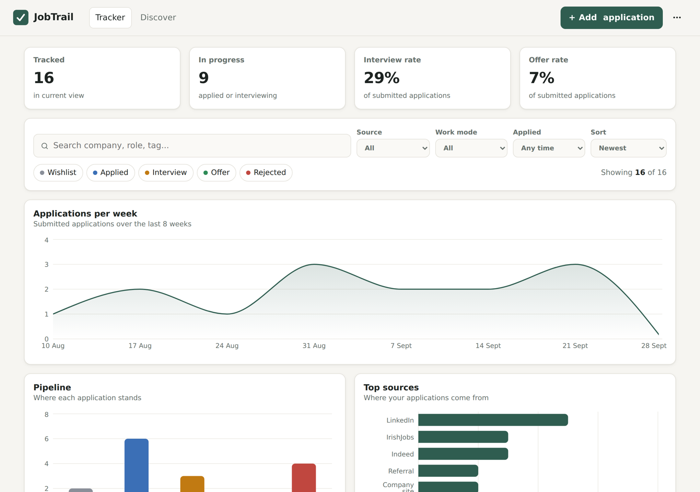
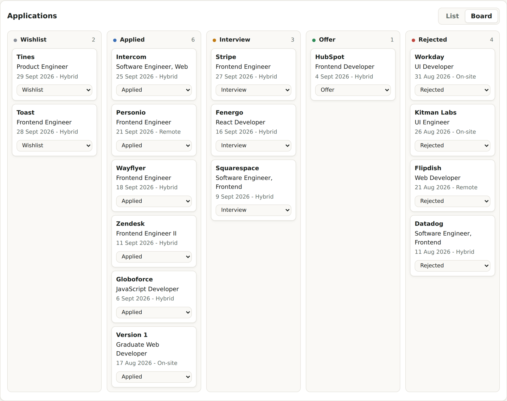
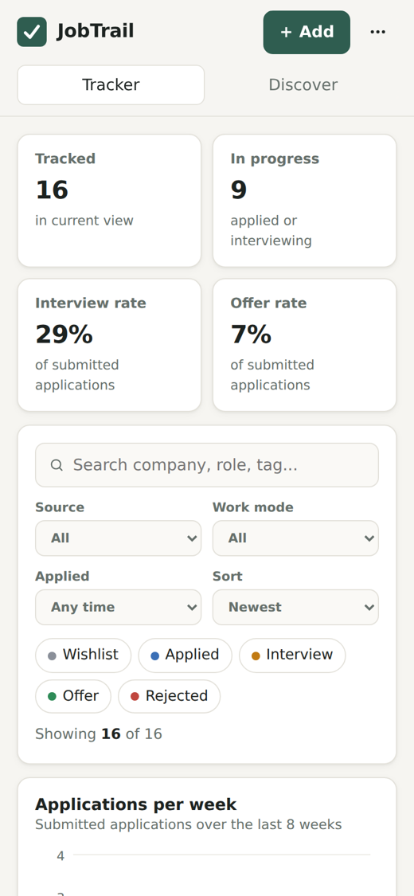

# JobTrail - Job Application Tracker

A responsive React dashboard I built to manage my own job search: log every application, filter the pipeline, see progress in charts, move roles through a Kanban board, and pull in new openings from a live jobs API.



## Features

- **Application tracker** - add, edit and delete applications with company, role, status, date, location, work mode, source, salary, tags, link and notes, with form validation and keyboard support.
- **Filters and search** - full-text search, multi-select status chips, source, work mode and date-range filters, and four sort orders. KPIs and charts recalculate live from the filtered view.
- **Analytics** - KPI cards (tracked, in progress, interview rate, offer rate) and three Recharts charts: weekly application trend, pipeline by stage and top sources.
- **Kanban board** - drag and drop between stages on desktop, with a stage dropdown on each card for touch and keyboard users.
- **Discover tab** - live listings from the free Arbeitnow Job Board API, served through a Vercel serverless function, with one-click "Track" to the Wishlist.
- **Persistence** - data is saved in `localStorage`, with JSON export and import for backups.
- **Responsive and accessible** - the table becomes stacked cards on mobile, the board scrolls with snap, dark mode follows the system setting, and focus states, ARIA labels and reduced motion are handled.



## How I built it

I wanted a single project that shows React, API integration and responsive design working together, built around something I actually use during my job search.

- **Stack:** React 18 with Vite for a fast dev loop, Recharts for charts, plain CSS with custom properties for theming, and Vitest for tests. I left out a UI library so the layout and responsive behaviour are my own.
- **State and logic:** App state lives in one top-level component and flows down as props. Filtering, sorting, KPIs and chart aggregations are pure functions in `src/lib/stats.js`, separate from React, which kept the components small and made the logic easy to unit test.
- **API integration:** The browser doesn't call the jobs API directly. A Vercel serverless function (`api/jobs.js`) fetches Arbeitnow on the server, reshapes the response into a small, stable format and caches it at the edge for 10 minutes. This avoids CORS problems and keeps repeat visits fast. In local development, Vite proxies the same `/api/jobs` route.
- **Responsive design:** I designed mobile-first with CSS grid and three breakpoints. The hardest part was the applications table: below 720px it becomes a list of labelled cards using `data-label` attributes, so no columns scroll off-screen.
- **Resilience:** Storage access is wrapped so the app still works in private browsing, and if the jobs API is down the Discover tab shows a retry state while the tracker keeps working.
- **Testing:** Unit tests cover filtering, date ranges, conversion rates and weekly bucketing, including edge cases like an empty list and excluding Wishlist items from rates. I also checked layouts at desktop and 390px mobile widths in both light and dark mode.
- **Deployment:** Hosted on Vercel and connected to this GitHub repo, so every push to `main` builds and deploys automatically.

<p align="center"></p>

## Tech stack

React 18 - Vite 5 - Recharts - Vercel Serverless Functions - Vitest - CSS (custom properties, grid, media queries)

## Project structure

```
api/jobs.js             Serverless function: fetches, normalises and caches job listings
src/App.jsx             App state, create/update/delete, import/export
src/components/         Header, KpiCards, Filters, ChartsPanel, JobTable, Board, JobForm, Discover
src/lib/stats.js        Pure filtering and aggregation logic
src/lib/stats.test.js   Unit tests
src/lib/storage.js      localStorage persistence with safe fallbacks
src/data/seed.js        Sample data with dates relative to today
src/styles.css          Design tokens, light and dark themes, responsive layout
```

## Run locally

```bash
npm install
npm run dev      # http://localhost:5173
npm test         # unit tests
```

## What I'd add next

- Sync across devices with a hosted database and sign-in
- Reminders for follow-ups and interview dates
- Migration to TypeScript and component tests with React Testing Library
